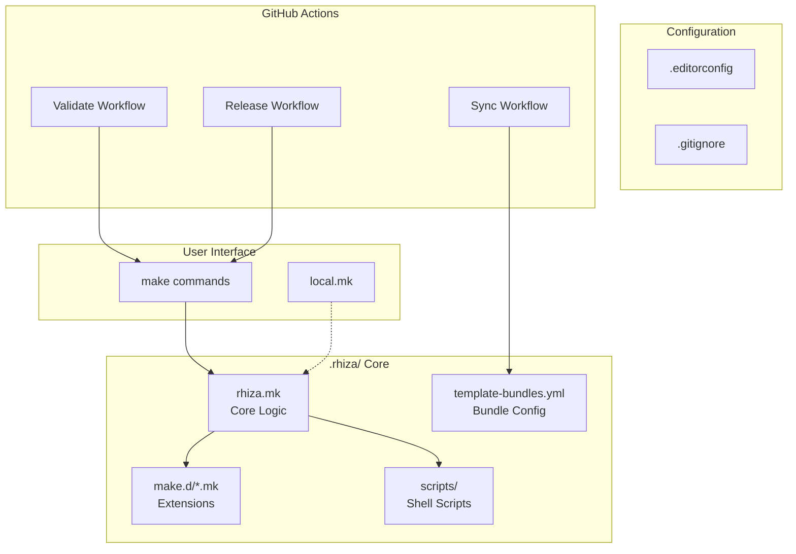
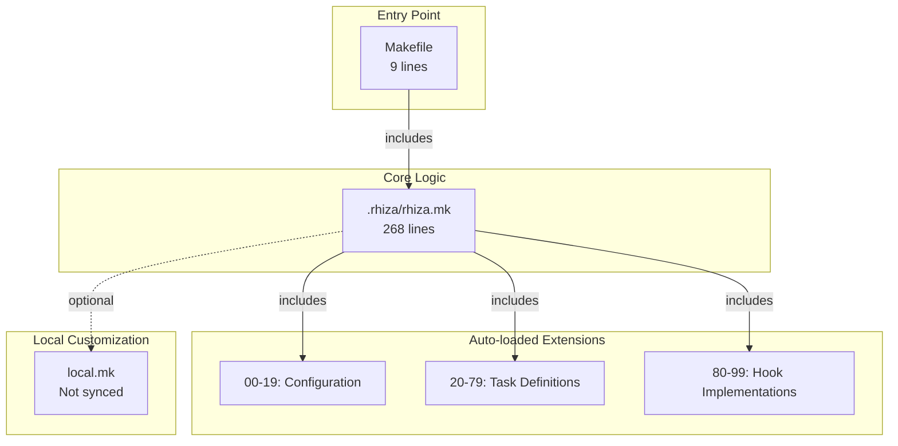
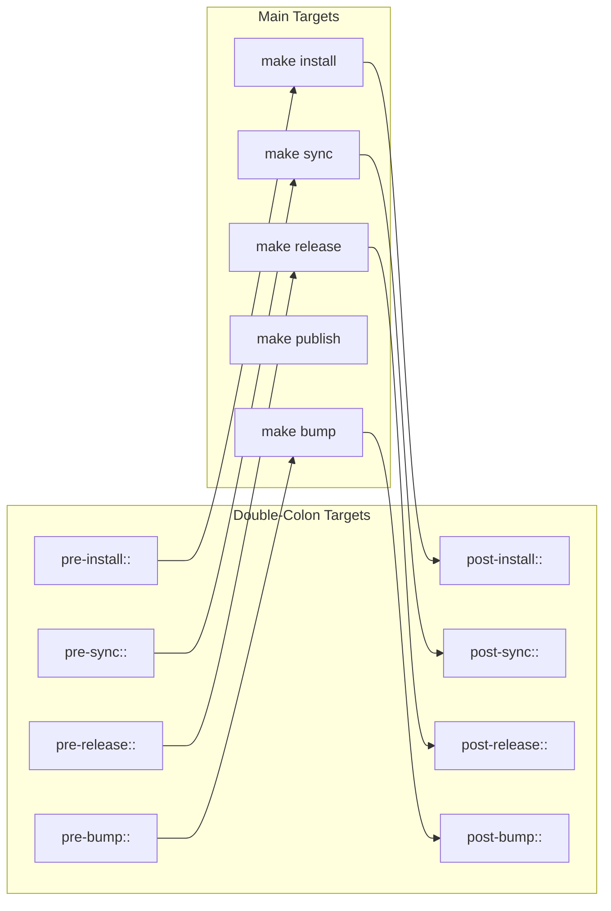
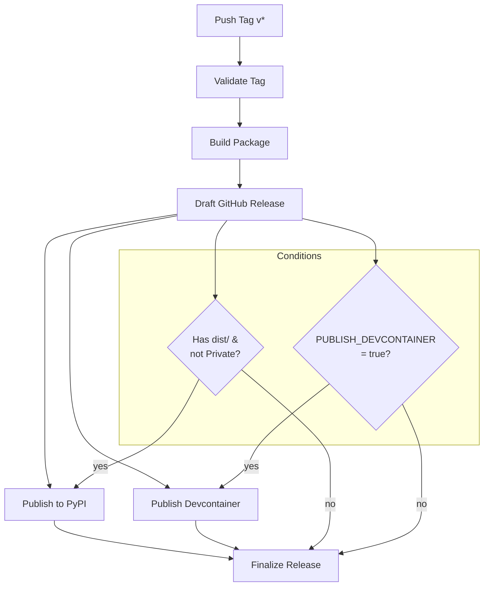
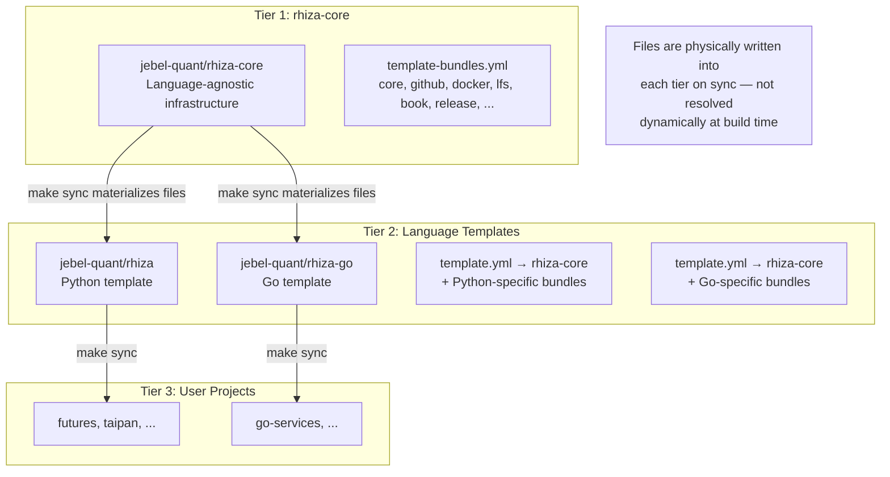
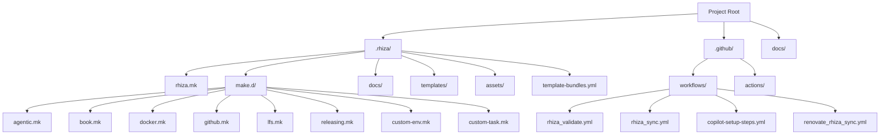
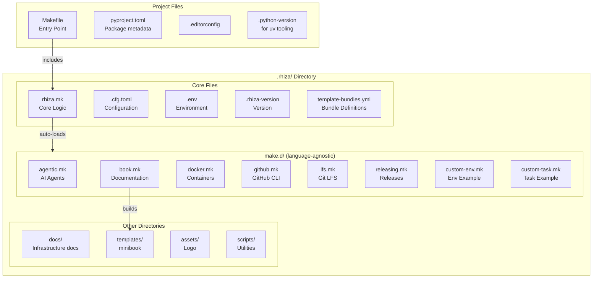
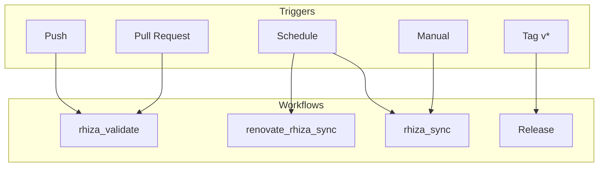
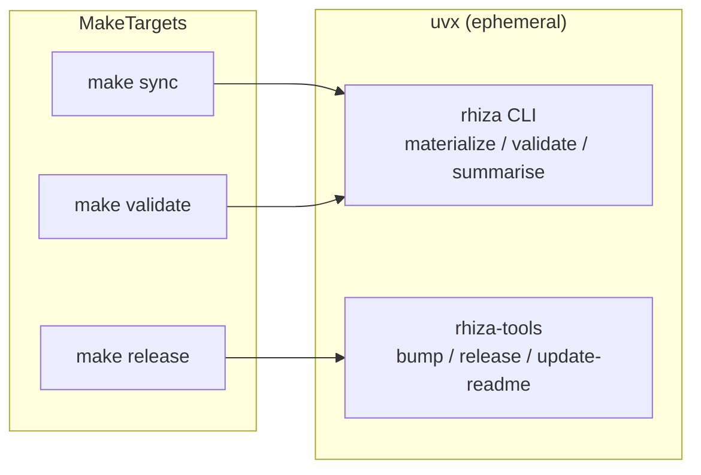

# Rhiza Architecture

Visual diagrams of Rhiza's architecture and component interactions.

## System Overview



## Makefile Hierarchy



## Hook System



## Release Pipeline



## Template Sync Flow



## Directory Structure



## .rhiza/ Directory Structure and Dependencies



## CI/CD Workflow Triggers (rhiza-core)



## Tool Execution Model

rhiza-core uses `uv`/`uvx` to run rhiza-cli tooling. This is true even for language templates that are not Python — `uv` is a build-time dependency of the template management toolchain, not of the project being templated.



## Naming Conventions and Organization Patterns

### Makefile Naming (`.rhiza/make.d/`)

Makefiles follow these conventions:

1. **Lowercase with hyphens**: All makefile names use lowercase letters with hyphens for word separation
   - ✅ `bootstrap.mk`, `custom-task.mk`, `github.mk`
   - ❌ `Bootstrap.mk`, `customTask.mk`, `GitHub.mk`

2. **Descriptive domain names**: Each file represents a logical domain or feature area
   - `agentic.mk` - AI agent integrations
   - `bootstrap.mk` - Installation and setup
   - `docker.mk` - Docker containerization
   - `marimo.mk` - Marimo notebooks
   - `test.mk` - Testing infrastructure

3. **Example vs. Production files**:
   - Files prefixed with `custom-` are **examples** for user customization
   - `custom-env.mk` - Example environment variable customizations
   - `custom-task.mk` - Example custom task definitions
   - Users should create their own files or modify the root `Makefile` for customizations

### Target Naming

Make targets follow consistent patterns:

1. **Lowercase with hyphens**: Target names use lowercase with hyphens
   - ✅ `install-uv`, `docker-build`, `view-prs`
   - ❌ `installUv`, `docker_build`, `viewPRs`

2. **Verb-noun pattern**: Action-oriented targets use verb-noun format
   - `install-uv` - Install the uv tool
   - `docker-build` - Build Docker image
   - `view-prs` - View pull requests

3. **Namespace prefixes**: Related targets share a common prefix
   - Docker: `docker-build`, `docker-run`, `docker-clean`
   - LFS: `lfs-install`, `lfs-pull`, `lfs-track`, `lfs-status`
   - GitHub: `gh-install`, `view-prs`, `view-issues`, `failed-workflows`

### Section Headers (`##@`)

Section headers in makefiles group related targets in help output:

1. **Title Case**: Section names use Title Case
   - `##@ Bootstrap`
   - `##@ GitHub Helpers`
   - `##@ Marimo Notebooks`

2. **Descriptive grouping**: Sections group logically related commands
   - **Bootstrap** - Installation and setup
   - **Development and Testing** - Core dev workflow
   - **Documentation** - Doc generation
   - **GitHub Helpers** - GitHub CLI integrations
   - **Quality and Formatting** - Code quality tools

### Hook Naming

Hook targets use double-colon syntax and follow a `pre-`/`post-` pattern:

```makefile
pre-install::    # Runs before make install
post-install::   # Runs after make install
pre-sync::       # Runs before make sync
post-sync::      # Runs after make sync
pre-release::    # Runs before make release
post-release::   # Runs after make release
```

**Key principles**:
- Always use double-colon (`::`) to allow multiple definitions
- Hooks are defined as phony targets
- Empty default implementations use `; @:` syntax

### File Organization Patterns

1. **Directory naming**:
   - Lowercase with hyphens: `make.d/`, `template-bundles.yml`
   - Plural for collections: `requirements/`, `templates/`, `tests/`

2. **Test organization** (`.rhiza/tests/`):
   - Tests grouped by **purpose**, not by feature
   - `api/` - Makefile API tests
   - `structure/` - Project structure validation
   - `integration/` - End-to-end workflows
   - `sync/` - Template synchronization
   - `deps/` - Dependency validation

3. **Requirements organization** (`.rhiza/requirements/`):
   - Named by **purpose**: `tests.txt`, `docs.txt`, `marimo.txt`, `tools.txt`
   - Not by library: ❌ `pytest.txt`, `pdoc.txt`

### Template Bundle Naming

Template bundles in `template-bundles.yml` follow these conventions:

1. **Lowercase singular**: `core`, `github`, `tests`, `marimo`, `book`
2. **Domain-focused**: Named after the feature domain, not implementation
   - ✅ `marimo` (notebooks)
   - ✅ `book` (documentation)
   - ❌ `notebooks`, `documentation-generation`

3. **Bundle metadata**:
   - `description` - Clear, concise explanation
   - `standalone` - Whether bundle can be used independently
   - `requires` - Hard dependencies on other bundles
   - `recommends` - Soft dependencies that enhance functionality

### Variable Naming

Makefile variables follow these patterns:

1. **SCREAMING_SNAKE_CASE**: All uppercase with underscores
   - `INSTALL_DIR`, `UV_BIN`, `PYTHON_VERSION`, `VENV`

2. **Suffix patterns**:
   - `_BIN` - Executable paths: `UV_BIN`, `UVX_BIN`, `COPILOT_BIN`
   - `_DIR` - Directory paths: `INSTALL_DIR`, `DOCKER_FOLDER`
   - `_VERSION` - Version strings: `PYTHON_VERSION`, `RHIZA_VERSION`

3. **Namespace prefixes**: Related variables share prefixes
   - UV tooling: `UV_BIN`, `UVX_BIN`, `UV_LINK_MODE`
   - Color codes: `BLUE`, `GREEN`, `RED`, `YELLOW`, `RESET`, `BOLD`

### Documentation Naming

Documentation files use SCREAMING_SNAKE_CASE:

- `README.md` - Directory/project overview
- `ARCHITECTURE.md` - Architecture diagrams
- `CUSTOMIZATION.md` - Customization guide
- `QUICK_REFERENCE.md` - Command reference
- `SECURITY.md` - Security policy

### Workflow Naming (`.github/workflows/`)

GitHub Actions workflows use the pattern `rhiza_<feature>.yml`:

- `rhiza_ci.yml` - Continuous integration
- `rhiza_release.yml` - Release automation
- `rhiza_security.yml` - Security scanning
- `rhiza_sync.yml` - Template synchronization
- `rhiza_deptry.yml` - Dependency checking

**Rationale**: The `rhiza_` prefix clearly identifies template-managed workflows, distinguishing them from user-defined workflows.

## Key Design Principles

### 1. Single Source of Truth

- **Rhiza version**: `.rhiza/.rhiza-version` file (controls which rhiza-cli version is used for sync/validate)
- **Bundle definitions**: `template-bundles.yml` (defines what language templates can inherit)
- **Language-specific versions** (in consuming templates, not here): `.python-version`, `.go-version`, etc.

### 2. Auto-Loading Pattern

Makefiles in `.rhiza/make.d/` are automatically included:

```makefile
# In .rhiza/rhiza.mk (last line)
-include .rhiza/make.d/*.mk
```

This allows:
- Adding new features by dropping in a `.mk` file
- No manual maintenance of include lists
- Clean separation of concerns

### 3. Extension Points

Users can extend Rhiza without modifying template files:

1. **Root Makefile**: Add custom targets before `include .rhiza/rhiza.mk`
2. **local.mk**: Local shortcuts (not committed, auto-loaded)
3. **Hooks**: Use double-colon targets (`post-install::`, etc.)

### 4. Fail-Safe Defaults

- Missing tools are detected and installation offered
- Missing directories are created automatically
- Graceful degradation when optional features are unavailable

### 5. Documentation as Code

- Every target has a `##` help comment
- Section headers (`##@`) organize help output
- README files in every major directory
- Comprehensive INDEX.md for quick reference
